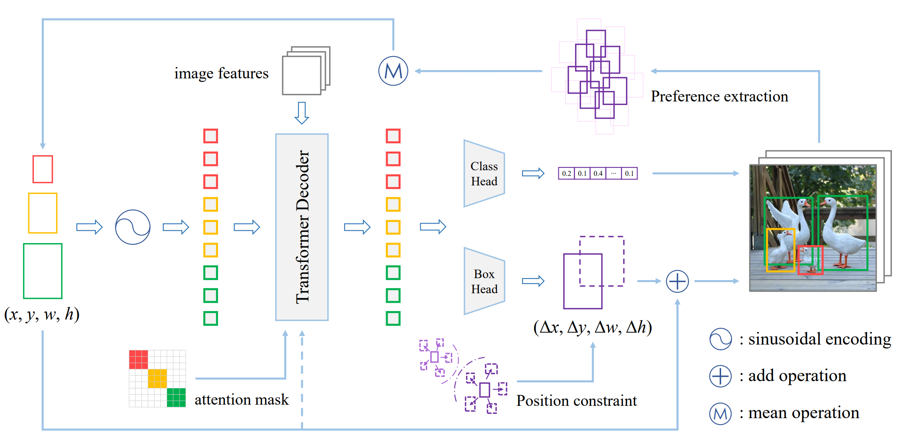

TEAM DETR: GUIDE QUERIES AS A PROFESSIONAL TEAM IN DETECTION TRANSFORMERS
--------

Official implementation

[[paper link](https://arxiv.org/abs/2302.07116)]

## Abstract

Recent proposed DETR variants have made tremendous progress in various scenarios due to their streamlined processes and remarkable performance. However, the learned queries usually explore the global context to generate the final set prediction, resulting in redundant burdens and unfaithful results. More specifically, a query is commonly responsible for objects of different scales and positions, which is a challenge for the query itself, and will cause spatial resource competition among queries. To alleviate this issue, we propose Team DETR, which leverages query collaboration and position constraints to embrace objects of interest more precisely. We also dynamically cater to each query member's prediction preference, offering the query better scale and spatial priors. In addition, the proposed Team DETR is flexible enough to be adapted to other existing DETR variants without increasing parameters and calculations. Extensive experiments on the COCO dataset show that Team DETR achieves remarkable gains, especially for small and large objects. 


## Framework



The framework of the proposed Team DETR, which is based on the basic architecture of DAB-DETR. The CNN backbone is used to extract image features, which are then fused by the transformer encoder. The decoder utilizes several learned queries to match objects for the image features. A query is represented as an anchor box (x, y, w, h) and is dynamically updated based on the offset (Δx, Δy, Δw, Δh) predicted by each layer of the decoder. Building upon this, we introduce a query teamwork approach in which the queries are grouped, and each group is responsible for objects within a specific scale range. To avoid resource competition, the management area of each query is limited. Furthermore, the prediction preferences of each query are dynamically extracted, and the anchor is updated accordingly.

## Model Zoo

Without increasing parameters and calculations, our query teamwork can be easily plugged into DAB-based DETRs, including DAB-DETR, DN-DETR and the single-stage DINO.

[[model zoo in 百度网盘]](https://pan.baidu.com/s/1ZLPAB6Mg0jVSKxECq4f_Jg?pwd=team)（提取码team）

[[model zoo in Google Drive]](https://drive.google.com/drive/folders/1vL7XnQ37W7wNF1flTm9r8vVjx_YbBZko?usp=share_link)

| Model                  | w/ Team DETR | Epochs |    AP    | AP<font size=2>*s*</font> | AP<font size=2>*m*</font> | AP<font size=2>*l*</font> | Params |                       checkpoint & log                       |
| ---------------------- | :----------: | :----: | :------: | :-----------------------: | :-----------------------: | :-----------------------: | :----: | :----------------------------------------------------------: |
| DN-DETR-R50            |              |   12   |   37.3   |           17.2            |           40.1            |           55.6            |  44M   |                                                              |
| DN-DETR-R50            |      √       |   12   | **37.7** |           18.0            |           40.0            |           56.8            |  44M   | [百度网盘](https://pan.baidu.com/s/1fc4144ERAjR4BpE9AjtasA?pwd=team) / [Google Drive](https://drive.google.com/drive/folders/1acSG-EuFx6UiehX1q63XAtu1EF3s29-m?usp=share_link) |
| DAB-DETR-R50           |              |   12   |   33.7   |           15.3            |           36.5            |           49.7            |  44M   |                                                              |
| DAB-DETR-R50           |      √       |   12   | **35.3** |           17.3            |           37.5            |           52.9            |  44M   | [百度网盘](https://pan.baidu.com/s/1kW9fpS2EYq3Q6KSchIU14A?pwd=team) / [Google Drive](https://drive.google.com/drive/folders/1MGel4BKzOrlYlDnuKxLeOJYkC5O58kF4?usp=share_link) |
| DAB-DETR-R50           |              |   50   |   42.2   |           22.5            |           45.9            |           60.2            |  44M   |                                                              |
| DAB-DETR-R50           |      √       |   50   | **43.0** |           24.4            |           46.1            |           62.6            |  44M   | [百度网盘](https://pan.baidu.com/s/1wR5lrD1Ji5q7F8eRAASrmg?pwd=team) / [Google Drive](https://drive.google.com/drive/folders/1clGOqBRioL4UVph684pTv4UsqQ47AmKJ?usp=share_link) |
| DAB-DETR-R101          |              |   12   |   36.1   |           17.3            |           39.5            |           52.5            |  63M   |                                                              |
| DAB-DETR-R101          |      √       |   12   | **37.4** |           18.4            |           40.3            |           55.5            |  63M   | [百度网盘](https://pan.baidu.com/s/1Nv6Tk8GZDVuMppFZV7DXnQ?pwd=team) / [Google Drive](https://drive.google.com/drive/folders/1dQ4Pqt4FgJB5z48juNRcxzJck2bAV4fa?usp=share_link) |
| DAB-DETR-R101          |              |   50   |   43.3   |           24.0            |           47.1            |           61.2            |  63M   |                                                              |
| DAB-DETR-R101          |      √       |   50   | **44.1** |           25.0            |           47.1            |           63.7            |  63M   | [百度网盘](https://pan.baidu.com/s/1606YBaEyjX4vgBZJ2GptpQ?pwd=team) / [Google Drive](https://drive.google.com/drive/folders/1jmTpzsdpWaYTVoBjysBUxyk4Ln6I03TD?usp=share_link) |
| DINO-4scale-1stage-R50 |              |   12   |   44.5   |           24.2            |           48.0            |           61.2            |  47M   |                                                              |
| DINO-4scale-1stage-R50 |      √       |   12   | **46.3** |           28.6            |           48.9            |           61.2            |  47M   | [百度网盘](https://pan.baidu.com/s/14NJTm3LLNWXHVkRG8JQ6Hg?pwd=team) / [Google Drive](https://drive.google.com/drive/folders/1PsiEGb1EFEpEeUrZEspwEmtYPYerVfS8?usp=share_link) |

**Note:** The result of DAB-DETR-R50 w/ Team-DETR under the 50-epoch setting is different from which we report in the paper because we lost this checkpoint, and here is the one we retrained.

## Usage

### Installation
Our code contains three projects, Team-DAB-DETR, Team-DN-DETR, and Team-DINO, based on DAB-DETR, DN-DETR, and DINO, respectively, and no extra dependency is needed. So each of our projects can be installed the same way as its codebase. 

[[installation of DAB-DETR]](https://github.com/IDEA-Research/DAB-DETR)

[[installation of DN-DETR]](https://github.com/IDEA-Research/DN-DETR)

[[installation of DINO]](https://github.com/IDEA-Research/DINO)

Our experimental environment is `python 3.7 & pytorch 1.11.0+cu113`. We strongly recommend you use `pytorch >= 1.11.0` for its less GPU memory consumption. 

### Dataset
[COCO2017](https://cocodataset.org/) is used to validate our method. The directory structure is as follows:

```
COCODIR/
  ├── train2017/
  ├── val2017/
  └── annotations/
  	├── instances_train2017.json
  	└── instances_val2017.json
```

### Evaluation

You can download our pre-trained models ([百度网盘](https://pan.baidu.com/s/1ZLPAB6Mg0jVSKxECq4f_Jg?pwd=team) / [Google Drive](https://drive.google.com/drive/folders/1vL7XnQ37W7wNF1flTm9r8vVjx_YbBZko?usp=share_link))  or use your own for evaluation. 

In default, we divide the queries into three groups, with the proportion of 65%, 25%, and 15%, corresponding to relative scales of (0, 0.2], (0.2, 0.4], and (0.4, 1], respectively. `--q_splits` is to set the proportion of each group. `--matcher` has two options, `ori`(original HungarianMatcher) and `team`(TeamHungarianMatcher).

**Note:** The evaluation result under different batch sizes will have slight differences. The batch size we used to train each model is marked on the checkpoint filename (e.g., b8, b6). If you use the checkpoints we provide for evaluation and want to get the same results as we report, please use the same batch size as ours.

```bash
# Team-DAB-DETR 
# multi-gpu
python -m torch.distributed.launch --nproc_per_node=2 main.py \
  --coco_path /path/to/your/COCODIR \
  --resume /path/to/our/checkpoint \
  --output_dir /path/to/your/output/dir \
  --batch_size 8 \
  --matcher team \
  --q_splits 65 20 15 \
  --eval

# single-gpu
python main.py \
  --coco_path /path/to/your/COCODIR \
  --resume /path/to/our/checkpoint \
  --output_dir /path/to/your/output/dir \
  --batch_size 8 \
  --matcher team \
  --q_splits 65 20 15 \
  --eval

# --------------------------------------------

# Team-DN-DETR
# multi-gpu
python -m torch.distributed.launch --nproc_per_node=2 main.py \
  --coco_path /path/to/your/COCODIR \
  --resume /path/to/our/checkpoint \
  --output_dir /path/to/your/output/dir \
  --batch_size 8 \
  --matcher team \
  --q_splits 65 20 15 \
  --eval \
  --use_dn
  
# single-gpu
python main.py \
  --coco_path /path/to/your/COCODIR \
  --resume /path/to/our/checkpoint \
  --output_dir /path/to/your/output/dir \
  --batch_size 8 \
  --matcher team \
  --q_splits 65 20 15 \
  --eval \
  --use_dn

# --------------------------------------------

# Team-DINO
# You need to make config and .sh files in advance.
# multi-gpu
bash scripts/DINO_4scale_1stage_team_r50_e12_eval.sh /path/to/your/COCODIR /path/to/your/output/dir /path/to/your/checkpoint

```

### Training

In default, we divide the queries into three groups, with the proportion of 65%, 25%, and 15%, corresponding to relative scales of (0, 0.2], (0.2, 0.4], and (0.4, 1], respectively. `--q_splits` is to set the proportion of each group. `--matcher` has two options, `ori`(original HungarianMatcher) and `team`(TeamHungarianMatcher). If you want to change the responsible scale range of each group, you can modify matcher.py for Team-DAB-DETR and Team-DN-DETR or the config file for Team-DINO.

```bash
# Team-DAB-DETR and Team-DN-DETR
# multi-gpu (12-epoch setting / 1x setting)
python -m torch.distributed.launch --nproc_per_node=2 main.py \
  --coco_path /path/to/your/COCODIR \
  --resume /path/to/our/checkpoint \
  --output_dir /path/to/your/output/dir \
  --batch_size 8 \
  --epochs 12 \
  --lr_drop 8 \
  --matcher team \
  --q_splits 65 20 15
  
# multi-gpu (50-epoch setting)
python -m torch.distributed.launch --nproc_per_node=2 main.py \
  --coco_path /path/to/your/COCODIR \
  --resume /path/to/our/checkpoint \
  --output_dir /path/to/your/output/dir \
  --batch_size 8 \
  --epochs 50 \
  --lr_drop 40 \
  --matcher team \
  --q_splits 65 20 15
  
# single-gpu (12-epoch setting / 1x setting)
python main.py \
  --coco_path /path/to/your/COCODIR \
  --resume /path/to/our/checkpoint \
  --output_dir /path/to/your/output/dir \
  --batch_size 8 \
  --epochs 12 \
  --lr_drop 8 \
  --matcher team \
  --q_splits 65 20 15

# single-gpu (50-epoch setting)
python main.py \
  --coco_path /path/to/your/COCODIR \
  --resume /path/to/our/checkpoint \
  --output_dir /path/to/your/output/dir \
  --batch_size 8 \
  --epochs 50 \
  --lr_drop 40 \
  --matcher team \
  --q_splits 65 20 15

# --------------------------------------------

# Team-DINO
# You need to make config and .sh files in advance.
# multi-gpu
bash scripts/DINO_4scale_1stage_team_r50_e12.sh /path/to/your/COCODIR /path/to/your/output/dir

```

## How to integrate query teamwork into your model

The query teamwork contains three parts: scale-wise grouping, position constraint, and preference extraction.

For details, you can refer to our code. Based on the source code of DAB-DETR / DN-DETR / DINO, every change in our code is clearly marked with "# qt ...". The changes involve main.py, [DABDETR.py,] *transformer.py, matcher.py and engine.py.

## Links

Our Team DETR is based on the basic architecture of DAB-DETR and is flexible enough to be adapted to DAB-based DETRs.
- **DAB-DETR: Dynamic Anchor Boxes are Better Queries for DETR**  
  Shilong Liu, Feng Li, Hao Zhang, Xiao Yang, Xianbiao Qi, Hang Su, Jun Zhu, Lei Zhang   
  International Conference on Learning Representations (ICLR) 2022  
  [[Paper]](https://arxiv.org/abs/2201.12329) [[Code]](https://github.com/SlongLiu/DAB-DETR).     
- **DN-DETR: Accelerate DETR Training by Introducing Query DeNoising**  
  Feng Li*, Hao Zhang*, Shilong Liu, Jian Guo, Lionel M. Ni, Lei Zhang    
  IEEE Conference on Computer Vision and Pattern Recognition (CVPR) 2022.  
  [[Paper]](https://arxiv.org/abs/2203.01305) [[Code]](https://github.com/FengLi-ust/DN-DETR).   
- **DINO: DETR with Improved DeNoising Anchor Boxes for End-to-End Object Detection**   
  Hao Zhang*, Feng Li*, Shilong Liu*, Lei Zhang, Hang Su, Jun Zhu, Lionel M. Ni, Heung-Yeung Shum  
  arxiv 2022   
  [[paper]](https://arxiv.org/abs/2203.03605) [[code]](https://github.com/IDEACVR/DINO).  

## LICENSE
Team DETR is released under the Apache 2.0 license. Please see the [LICENSE](LICENSE) file for more information.

Copyright (c) IDEA. All rights reserved.

Licensed under the Apache License, Version 2.0 (the "License"); you may not use these files except in compliance with the License. You may obtain a copy of the License at http://www.apache.org/licenses/LICENSE-2.0

Unless required by applicable law or agreed to in writing, software distributed under the License is distributed on an "AS IS" BASIS, WITHOUT WARRANTIES OR CONDITIONS OF ANY KIND, either express or implied. See the License for the specific language governing permissions and limitations under the License.

## BibTex
If you find Team DETR useful in your research, please consider citing:   
```bibtex
coming soon ...
```
